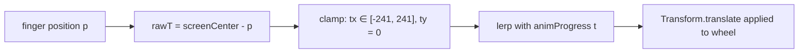

# Design Document: color-picker-immersive-zoom

## Overview

This feature adds an immersive zoom mode to the `ColorPickerWidget`. When the user begins a drag (pan) gesture on the wheel, the wheel expands to fill the entire `PhoneFrame` (414×896 logical pixels) while all other `AddColorScreen` UI fades out. A loupe transform keeps the point under the user's finger centred on screen, giving a large, precise picking surface. When the finger lifts, everything animates back to the normal inline layout.

The feature is additive: `ColorPickerWidget` gains two new optional callbacks (`onImmersiveModeChanged`) and an internal `AnimationController`. `AddColorScreen` gains a boolean state variable and wraps its non-wheel children in `AnimatedOpacity` / `IgnorePointer`. No existing public API is removed.

---

## Architecture

```
AddColorScreen (_AddColorScreenState)
│
├── _isImmersive: bool  ← driven by onImmersiveModeChanged callback
│
├── AnimatedOpacity(opacity: _isImmersive ? 0.0 : 1.0)   ← wraps all non-wheel UI
│   └── IgnorePointer(ignoring: _isImmersive)
│       └── [top bar, prompt, title field, reveal sections, buttons, home nav]
│
└── _ImmersiveWheelHost  (new StatefulWidget, owns AnimationController)
    │
    ├── AnimationController(duration: 300ms, vsync: this)
    │   └── CurvedAnimation(curve: Curves.easeInOut)
    │
    ├── _loupeOffset: Offset  ← current raw (unclamped) loupe translation
    │
    └── AnimatedBuilder
        └── Stack
            ├── Positioned / SizeTransition  ← wheel grows from inline rect to full frame
            └── Transform.translate(offset: _clampedLoupe)
                └── ColorPickerWidget(
                      onColorChanged: ...,
                      onImmersiveModeChanged: ...,
                      immersiveProgress: animation.value,   ← drives internal size
                    )
```

### Key design decisions

- **Single `AnimationController` for both zoom and fade.** The zoom size and the fade opacity are both driven by the same `CurvedAnimation` value, guaranteeing they are always in sync without any manual coordination.
- **Loupe transform lives in `_ImmersiveWheelHost`, not in `ColorPickerWidget`.** The widget that owns the `AnimationController` also owns the translation, keeping `ColorPickerWidget` free of layout concerns.
- **`ColorPickerWidget` stays layout-agnostic.** It reports gestures and colors via callbacks; the host decides how to size and position it.
- **`IgnorePointer` rather than `Visibility`.** Non-wheel widgets remain in the tree (preserving `TextEditingController` state) but receive no pointer events during immersive mode.

---

## Components and Interfaces

### `ColorPickerWidget` changes

```dart
class ColorPickerWidget extends StatefulWidget {
  final Color currentColor;
  final ValueChanged<Color> onColorChanged;

  // NEW — optional; null means NormalMode-only (backward compatible)
  final ValueChanged<bool>? onImmersiveModeChanged;

  const ColorPickerWidget({
    super.key,
    required this.currentColor,
    required this.onColorChanged,
    this.onImmersiveModeChanged,   // NEW
  });
}
```

Internal state additions to `_ColorPickerWidgetState`:

| Field | Type | Purpose |
|---|---|---|
| `_panStartPosition` | `Offset?` | Records the global position at `onPanStart` for threshold calculation |
| `_totalPanDistance` | `double` | Accumulated movement distance since pan start |
| `_isImmersive` | `bool` | Whether this widget is currently in immersive mode |

Gesture handler changes:

- `onPanStart` — record `_panStartPosition`, reset `_totalPanDistance = 0`.
- `onPanUpdate` — accumulate `_totalPanDistance`; if it crosses 8 px for the first time, call `onImmersiveModeChanged?.call(true)` and set `_isImmersive = true`; always call `_handleColorSelection`.
- `onPanEnd` — if `_isImmersive`, call `onImmersiveModeChanged?.call(false)` and reset `_isImmersive = false`; do **not** call `_openMosaic`. If not immersive (tap path), existing logic runs unchanged.
- `onTapDown` / `onTapUp` — unchanged; only reached when total movement stayed below 8 px.

### `_ImmersiveWheelHost` (new `StatefulWidget`)

Replaces the existing `_BigWheel` stateless widget in `AddColorScreen`. Owns:

- `AnimationController _zoomCtrl` (300 ms, `TickerProviderStateMixin`)
- `CurvedAnimation _zoomAnim` (`Curves.easeInOut`)
- `Offset _loupeOffset` — updated on every pan update from `ColorPickerWidget`

Exposes to `AddColorScreen` via callback: none — it calls `widget.onImmersiveModeChanged` which `AddColorScreen` passes down.

### `AddColorScreen` changes

New state field: `bool _isImmersive = false`

`onImmersiveModeChanged` handler:
```dart
void _onImmersiveModeChanged(bool immersive) {
  setState(() => _isImmersive = immersive);
}
```

The `SafeArea > Column` body is restructured so that:
1. The `_ImmersiveWheelHost` is placed in a `Stack` that can expand to fill the frame.
2. All other children are wrapped in:
   ```dart
   IgnorePointer(
     ignoring: _isImmersive,
     child: AnimatedOpacity(
       opacity: _isImmersive ? 0.0 : 1.0,
       duration: const Duration(milliseconds: 300),
       curve: Curves.easeInOut,
       child: /* non-wheel UI */,
     ),
   )
   ```

---

## Data Models

No new persistent data models. The following transient state is introduced:

### `ImmersiveGestureState` (conceptual, lives inside `_ColorPickerWidgetState`)

```
panStartPosition : Offset?   // global coords at gesture start
totalPanDistance : double    // cumulative movement in logical px
isImmersive      : bool      // whether threshold was crossed
```

### `LoupeState` (conceptual, lives inside `_ImmersiveWheelHost`)

```
rawOffset    : Offset   // unclamped translation from loupe math
clampedOffset: Offset   // clamped to wheel bounds
animProgress : double   // 0.0 = NormalMode, 1.0 = ImmersiveMode
```

### Wheel geometry constants (web / PhoneFrame)

| Symbol | Value | Meaning |
|---|---|---|
| `kFrameWidth` | 414.0 | PhoneFrame logical width |
| `kFrameHeight` | 896.0 | PhoneFrame logical height |
| `kNormalWheelSize` | computed at layout time | Side length of the inline `AspectRatio(1)` square |
| `kImmersiveWheelSize` | 896.0 | Wheel side length in ImmersiveMode (fills height; wheel is square) |

---

## Loupe Transform Math

### Goal

While in ImmersiveMode the wheel is rendered at `kImmersiveWheelSize × kImmersiveWheelSize` (896×896 px). The screen is 414×896. The wheel is wider than the screen by `896 - 414 = 482 px`, so it can be panned horizontally. Vertically the wheel exactly fills the screen, so no vertical panning is needed (clamp to zero).

### Raw translation

Let:
- `F = Offset(kFrameWidth/2, kFrameHeight/2)` — screen centre (207, 448)
- `p` — current finger position in **screen** coordinates
- `W = kImmersiveWheelSize` — wheel side length (896)
- `wheelCenter = Offset(W/2, W/2)` — centre of the wheel canvas (448, 448)

The loupe translation `T` that places the finger point at screen centre satisfies:

```
wheelCenter + T + (p - wheelCenter) == F
⟹  T = F - p
```

In other words: **`T = screenCenter - fingerPosition`** (in screen coordinates).

### Clamping

The wheel is rendered at size `W × W` and translated by `T`. To prevent the wheel from exposing empty space:

```
maxTx = (W - kFrameWidth)  / 2   // = (896 - 414) / 2 = 241 px
maxTy = (W - kFrameHeight) / 2   // = (896 - 896) / 2 = 0 px

clampedTx = T.dx.clamp(-maxTx, maxTx)
clampedTy = T.dy.clamp(-maxTy, maxTy)   // always 0 for 414×896 frame
```

### Animation-driven lerp

During the zoom-in/zoom-out animation the loupe translation is lerped from `Offset.zero` (NormalMode) to the live `rawOffset` (ImmersiveMode) using the animation progress `t`:

```
effectiveOffset = Offset.lerp(Offset.zero, clampedOffset, t)!
```

This ensures the loupe smoothly engages as the wheel expands and smoothly disengages as it contracts.

### Mermaid diagram



---

## Correctness Properties

*A property is a characteristic or behavior that should hold true across all valid executions of a system — essentially, a formal statement about what the system should do. Properties serve as the bridge between human-readable specifications and machine-verifiable correctness guarantees.*

### Property 1: Tap threshold never triggers immersive mode

*For any* gesture where the total pointer movement from pan start to pan end is less than 8 logical pixels, the `onImmersiveModeChanged` callback SHALL NOT be called with `true`, and the widget SHALL process the gesture as a tap.

**Validates: Requirements 1.4, 7.1, 7.3**

---

### Property 2: Pan threshold triggers immersive mode and suppresses mosaic navigation

*For any* gesture where the total pointer movement from pan start to pan end is 8 logical pixels or greater, the `onImmersiveModeChanged` callback SHALL be called with `true` during the gesture, and no mosaic navigation SHALL occur when the gesture ends.

**Validates: Requirements 7.2, 7.4, 5.3**

---

### Property 3: Loupe centering — raw translation places finger at screen centre

*For any* finger position `p` (in screen coordinates) while ImmersiveMode is active, the raw loupe translation `T = screenCenter - p` SHALL satisfy the invariant that the wheel point under the finger maps to the screen centre: `wheelCenter + T + (p - wheelCenter) == screenCenter`.

**Validates: Requirements 2.1**

---

### Property 4: Loupe clamping keeps wheel within screen bounds

*For any* raw loupe translation `T` and any PhoneFrame dimensions `(W, H)` with wheel size `S >= W` and `S >= H`, the clamped translation `T'` SHALL satisfy `|T'.dx| <= (S - W) / 2` and `|T'.dy| <= (S - H) / 2`, ensuring no empty space is exposed at any screen edge.

**Validates: Requirements 2.2**

---

### Property 5: Color is retained after any pan sequence

*For any* sequence of pan update positions ending at position `p_last`, after the pan gesture ends the `selectedColor` inside `ColorPickerWidget` SHALL equal the color computed from `p_last`, and `onColorChanged` SHALL have been called with that color.

**Validates: Requirements 4.1, 4.2**

---

### Property 6: Animation interruption — forward from any reverse progress

*For any* animation progress value `t ∈ (0, 1)` while the `ZoomAnimation` is reversing (returning to NormalMode), a new pan start SHALL cause the animation to begin animating forward from `t` rather than from `0`, so that no visual jump occurs.

**Validates: Requirements 6.1**

---

### Property 7: Animation interruption — reverse from any forward progress

*For any* animation progress value `t ∈ (0, 1)` while the `ZoomAnimation` is animating forward (entering ImmersiveMode), a pan end SHALL cause the animation to begin reversing from `t` rather than from `1`, so that no visual jump occurs.

**Validates: Requirements 6.2**

---

### Property 8: Fade opacity is always in sync with zoom animation progress

*For any* animation progress value `t ∈ [0, 1]` at any point in time (including during interruptions), the opacity of non-wheel UI elements SHALL equal `1.0 - curvedT` where `curvedT` is the eased value of `t`, ensuring the fade and zoom are never out of sync.

**Validates: Requirements 6.3, 1.3, 3.3**

---

### Property 9: Backward compatibility — null callback leaves widget fully functional

*For any* gesture sequence (taps, pans, or mixed) performed on a `ColorPickerWidget` where `onImmersiveModeChanged` is `null`, the widget SHALL not throw any error, SHALL call `onColorChanged` correctly, and SHALL navigate to mosaic screens on valid taps, exactly as it did before this feature was added.

**Validates: Requirements 8.4**

---

### Property 10: Loupe translation is zero when animation is at rest in NormalMode

*For any* state where the `ZoomAnimation` progress is `0.0` (NormalMode), the effective loupe translation applied to the wheel SHALL be `Offset.zero`, regardless of any previously accumulated `rawOffset`.

**Validates: Requirements 3.4**

---

## Error Handling

| Scenario | Handling |
|---|---|
| `_wheelKey` has no `RenderBox` during pan (widget not yet laid out) | Guard with `if (box == null) return;` — already present; no change needed |
| `onImmersiveModeChanged` is null | Null-safe call `onImmersiveModeChanged?.call(...)` — no-op |
| Widget disposed while `AnimationController` is running | `dispose()` calls `_zoomCtrl.dispose()`; `AnimatedBuilder` uses `mounted` guard |
| Pan gesture fires before threshold is crossed then widget is removed | `_isImmersive` is false; no callback fired; no cleanup needed |
| Finger moves outside wheel bounds during ImmersiveMode | `_handleColorSelection` already guards with `distance <= maxRadius`; loupe clamp prevents empty space |
| `AnimationController.forward()` called while already at 1.0 | No-op in Flutter; safe |
| `AnimationController.reverse()` called while already at 0.0 | No-op in Flutter; safe |

---

## Testing Strategy

### Unit tests (example-based)

- `ColorPickerWidget` with `onImmersiveModeChanged` null — verify no crash on pan and tap.
- `ColorPickerWidget` with `onImmersiveModeChanged` provided — verify callback fires `true` on pan start (after threshold) and `false` on pan end.
- Tap on colored ring in NormalMode — verify `onColorChanged` called and `_openMosaic` triggered.
- Tap on neutral hub in NormalMode — verify `_openNeutralMosaic` triggered.
- Pan end after immersive — verify mosaic navigation NOT triggered.
- `AnimationController` disposed cleanly when widget removed during ImmersiveMode.
- `AnimatedOpacity` opacity value at `_isImmersive = true` and `_isImmersive = false`.
- `IgnorePointer.ignoring` value matches `_isImmersive`.

### Property-based tests

Use the [`fast_check`](https://pub.dev/packages/fast_check) package (Dart port of fast-check). Each property test runs a minimum of **100 iterations**.

Tag format: `// Feature: color-picker-immersive-zoom, Property N: <property text>`

| Property | Generator inputs | Assertion |
|---|---|---|
| P1 — tap threshold | `distance ∈ [0.0, 7.99)` (arbitrary) | `onImmersiveModeChanged` never called with `true` |
| P2 — pan threshold | `distance ∈ [8.0, 500.0)` | `onImmersiveModeChanged` called with `true`; no navigation on end |
| P3 — loupe centering | `fingerPos: Offset` within frame bounds | `screenCenter - fingerPos == rawTranslation` |
| P4 — loupe clamping | `rawTx ∈ [-1000, 1000]`, `rawTy ∈ [-1000, 1000]` | `|clampedTx| <= maxTx`, `|clampedTy| <= maxTy` |
| P5 — color retention | sequence of `Offset` pan positions on wheel | `selectedColor == colorAt(lastPosition)` |
| P6 — interrupt forward | `t ∈ (0.0, 1.0)` during reverse | animation value increases after pan start |
| P7 — interrupt reverse | `t ∈ (0.0, 1.0)` during forward | animation value decreases after pan end |
| P8 — fade sync | `t ∈ [0.0, 1.0]` | `opacity == 1.0 - curvedT` at every sampled t |
| P9 — backward compat | arbitrary gesture sequence | no exception; `onColorChanged` called correctly |
| P10 — loupe zero at rest | any `rawOffset` | effective offset == `Offset.zero` when `t == 0.0` |

### Integration / smoke tests

- Full `AddColorScreen` widget test: pan on wheel → verify `_isImmersive` becomes true → lift → verify `_isImmersive` becomes false.
- Verify `ColorPickerWidget` constructor still compiles without `onImmersiveModeChanged` (backward compat smoke).
